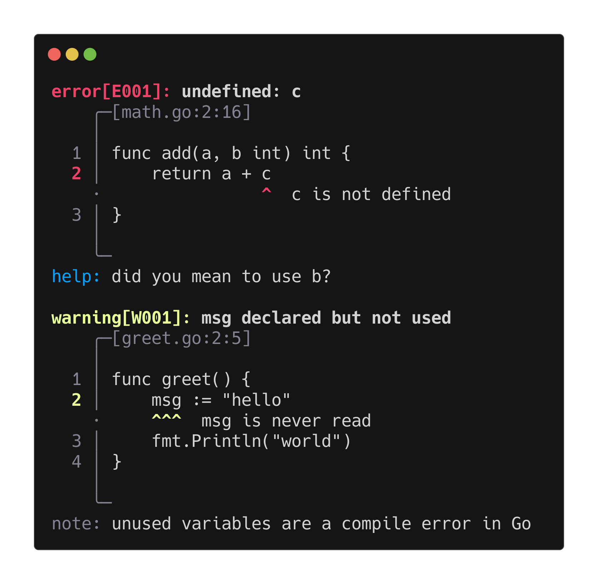

<div align="center">
  <h1>diag 🩺</h1>
  <p>Terminal diagnostic messages with source code context for Go.</p>
  <p>
    <a href="https://github.com/nuvrel/diag/releases"></a>
    <a href="https://github.com/nuvrel/diag/actions/workflows/build.yaml"></a>
    <a href="https://github.com/nuvrel/diag/actions/workflows/test.yaml"></a>
    <a href="https://pkg.go.dev/github.com/nuvrel/diag"></a>
    <a href="https://goreportcard.com/report/github.com/nuvrel/diag"></a>
    <a href="LICENSE"></a>
  </p>
</div>

<p align="center">
  
</p>

## Install

```sh
go get github.com/nuvrel/diag
```

## Usage

Build each diagnostic separately, then hand them all to the printer at once. `Print` accepts any number of diagnostics and renders them in order, with spacing between each one.

```go
src := []byte(`func add(a, b int) int {
    return a + c
}`)

d := diag.NewError("undefined: c").
    Code("E001").
    Snippet(diag.NewSnippet(src).
        File("math.go").
        From(2, 16).
        To(2, 17).
        Message("c is not defined")).
    Help("did you mean to use b?")

p := diag.NewPrinter(os.Stdout, diag.DefaultConfig())

if err := p.Print(d); err != nil {
    return fmt.Errorf("printing diagnostics: %w", err)
}
```

## Config

The `Config` struct controls every aspect of the output. Use the `Default*` helpers for the parts you want to keep as-is and override only what you need.

```go
cfg := diag.Config{
    Profile:        colorprofile.Detect(os.Stdout, os.Environ()),
    Theme:          diag.DefaultTheme(),
    Characters:     diag.DefaultCharacters(),
    Prefixes:       diag.DefaultPrefixes(),
    SeverityLabels: diag.DefaultSeverityLabels(),
}
```

**Localization**

Translate severity labels and block prefixes by replacing their defaults:

```go
cfg := diag.Config{
    Profile:    colorprofile.Detect(os.Stdout, os.Environ()),
    Theme:      diag.DefaultTheme(),
    Characters: diag.DefaultCharacters(),
    Prefixes: diag.Prefixes{
        Help: "ajuda",
        Note: "observação",
    },
    SeverityLabels: diag.SeverityLabels{
        Error:   "erro",
        Warning: "aviso",
    },
}
```

**Plain ASCII output**

For environments that cannot render box-drawing characters, swap in ASCII alternatives:

```go
cfg := diag.Config{
    Profile:    colorprofile.Ascii,
    Theme:      diag.DefaultTheme(),
    Characters: diag.Characters{
        Top:  ",",
        Mid:  "|",
        Bot:  "'",
        Dash: "-",
        Dot:  ".",
    },
    Prefixes:       diag.DefaultPrefixes(),
    SeverityLabels: diag.DefaultSeverityLabels(),
}
```

## API

**Diagnostics**

- `NewError(msg)` / `NewWarning(msg)` creates a new diagnostic
- `.Code(code)` attaches an error code shown in the header
- `.Snippet(s)` attaches a source code snippet
- `.Help(text)` appends a help note
- `.Note(text)` appends an informational note

**Snippets**

- `NewSnippet(src)` creates a snippet from a byte slice
- `.File(name)` sets the file name shown above the snippet
- `.From(line, col)` / `.To(line, col)` sets the highlighted range
- `.Message(text)` sets the label shown under the highlight
- `.Pad(n)` sets how many context lines to show around the highlight (default 2)
- `.TabWidth(n)` sets the tab width used for alignment (default 4)

## Stability

`diag` is pre-1.0. The API is functional and tested, but minor versions may introduce breaking changes as the library grows. If you depend on it, pin to a specific version and review the changelog before upgrading.

## Roadmap

These are the features planned before a stable 1.0 release:

- **Syntax highlighting** for snippet blocks, likely powered by [chroma](https://github.com/alecthomas/chroma), with configurable language detection and theme support
- **List blocks** for attaching structured bullet-point content to a diagnostic
- **Table blocks** for displaying tabular data inline in the output

Have a feature in mind that isn't listed here? [Open a feature request](https://github.com/nuvrel/diag/issues/new?template=feature_request.md).

## License

MIT
