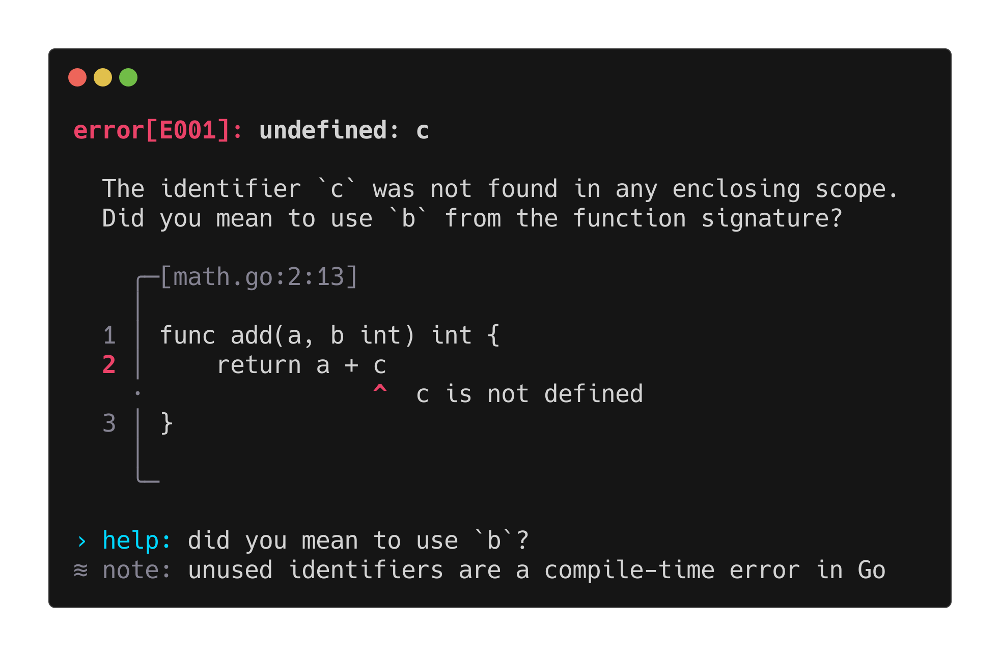

<div align="center">
  <h1>diag 🩺</h1>
  <p>Terminal diagnostic messages with source code context for Go.</p>
  <p>
    <a href="https://github.com/nuvrel/diag/releases"></a>
    <a href="https://github.com/nuvrel/diag/actions/workflows/build.yaml"></a>
    <a href="https://github.com/nuvrel/diag/actions/workflows/test.yaml"></a>
    <a href="https://pkg.go.dev/github.com/nuvrel/diag"></a>
    <a href="https://goreportcard.com/report/github.com/nuvrel/diag"></a>
    <a href="LICENSE"></a>
  </p>
</div>

<p align="center">
  
</p>

## Install

```sh
go get github.com/nuvrel/diag
```

## Usage

Build each diagnostic separately, then hand them all to the printer at once. `Print` accepts any number of diagnostics and renders them in order, with spacing between each one.

```go
src := []byte(`func add(a, b int) int {
	return a + c
}`)

d := diag.NewError("undefined: c").
	Code("E001").
	Detail(
		"Variables must be declared before use. The identifier `c` was not found in any enclosing scope.",
		"If you meant to use `b`, note that it was declared in the same function signature.",
	).
	Snippet(diag.NewSnippet(src).
		File("math.go").
		From(2, 13).
		To(2, 14).
		Message("c is not defined")).
	Help("did you mean to use b?")

p := diag.NewPrinter(os.Stdout, diag.DefaultConfig())

if err := p.Print(d); err != nil {
	return fmt.Errorf("printing diagnostics: %w", err)
}
```

## Config

The `Config` struct controls every aspect of the output. Use the `Default*` helpers for the parts you want to keep as-is and override only what you need.

```go
cfg := diag.Config{
	Profile:        colorprofile.Detect(os.Stdout, os.Environ()),
	Theme:          diag.DefaultTheme(),
	Characters:     diag.DefaultCharacters(),
	Prefixes:       diag.DefaultPrefixes(),
	SeverityLabels: diag.DefaultSeverityLabels(),
}
```

**Profile**

Controls color output. Detected automatically from the terminal by default. Set to `colorprofile.Ascii` or `colorprofile.NoTTY` to disable colors:

```go
cfg := diag.Config{
	Profile: colorprofile.Ascii,
	// ...
}
```

**Theme**

Controls the style of every visual element. All fields accept a `lipgloss.Style`:

```go
cfg := diag.Config{
	// ...
	Theme: diag.Theme{
		Error:   lipgloss.NewStyle().Foreground(lipgloss.Color("#EB4268")).Bold(true),
		Warning: lipgloss.NewStyle().Foreground(lipgloss.Color("#E8FE96")).Bold(true),
		Message: lipgloss.NewStyle().Bold(true),
		Detail:  lipgloss.NewStyle().Foreground(lipgloss.Color("#CCCCCC")),
		Help:    lipgloss.NewStyle().Foreground(lipgloss.Color("#00D7FF")),
		Note:    lipgloss.NewStyle().Foreground(lipgloss.Color("#858392")),
		Muted:   lipgloss.NewStyle().Foreground(lipgloss.Color("#858392")),
	},
}
```

**Characters**

Controls every character used in the output. Defaults use Unicode box-drawing characters and symbols. Swap to ASCII alternatives for environments that cannot render Unicode:

```go
cfg := diag.Config{
	// ...
	Characters: diag.Characters{
		Top:      ",",
		Mid:      "|",
		Bot:      "'",
		Dash:     "-",
		Dot:      ".",
		HintHelp: ">",
		HintNote: "~",
	},
}
```

`HintHelp` and `HintNote` are prepended to `help` and `note` lines. Set either to `""` to remove the prefix character entirely.

**Prefixes**

Controls the label text for `help` and `note` lines:

```go
cfg := diag.Config{
	// ...
	Prefixes: diag.Prefixes{
		Help: "ajuda",
		Note: "observação",
	},
}
```

**SeverityLabels**

Controls the label text for each severity level:

```go
cfg := diag.Config{
	// ...
	SeverityLabels: diag.SeverityLabels{
		Error:   "erro",
		Warning: "aviso",
	},
}
```

**DetailPad**

Controls the number of spaces used to indent `.Detail()` text (default `2`):

```go
cfg := diag.Config{
	// ...
	DetailPad: 4,
}
```

**Margin**

Controls the number of leading spaces added to every line of output that has content, leaving blank lines untouched. Useful for visually nesting diagnostics within other content (default `0`):

```go
cfg := diag.Config{
	// ...
	Margin: 4,
}
```

**SkipHeader / SkipDetail**

Controls whether the header or detail section is suppressed. Use these when the caller renders its own header or detail and only needs the remaining parts from the printer:

```go
cfg := diag.Config{
	// ...
	SkipHeader: true,
	SkipDetail: true,
}
```

**HeaderFunc**

Controls the header rendering. When non-nil, replaces the default renderer. It receives the severity label, error code (may be empty), and message, and must return a fully rendered string:

```go
cfg := diag.Config{
	// ...
	HeaderFunc: func(severity, code, message string) string {
		header := strings.ToUpper(severity)

		if code != "" {
			header += "[" + code + "]"
		}

		return header + ": " + message
	},
}
```

**DetailFunc**

Controls the detail rendering. When non-nil, replaces the default renderer. It receives the detail paragraphs and must return a fully rendered string:

```go
cfg := diag.Config{
	// ...
	DetailFunc: func(detail []string) string {
		return strings.Join(detail, "\n\n")
	},
}
```

## API

**Diagnostics**

- `NewError(msg)` / `NewWarning(msg)` creates a new diagnostic
- `.Code(code)` attaches an error code shown in the header
- `.Detail(paragraphs...)` sets the detail body rendered as indented prose below the header
- `.Snippet(s)` attaches a source code snippet
- `.Help(text)` appends a help note
- `.Note(text)` appends an informational note
- `.Severity()` returns the severity level of the diagnostic
- `.Message()` returns the primary message of the diagnostic

Regardless of the order methods are chained, the output always renders in a fixed sequence: header, detail, snippets, then hints (help and note).

**Snippets**

- `NewSnippet(src)` creates a snippet from a byte slice
- `.File(name)` sets the file name shown above the snippet
- `.From(line, col)` / `.To(line, col)` sets the highlighted range
- `.Message(text)` sets the label shown under the highlight
- `.Pad(n)` sets how many context lines to show around the highlight (default 2)
- `.TabWidth(n)` sets the tab width used for alignment (default 4)
- `.Margin(n)` adds leading spaces to every line inside the snippet block

## Stability

`diag` is pre-1.0. The API is functional and tested, but minor versions may introduce breaking changes as the library grows. If you depend on it, pin to a specific version and review the changelog before upgrading.

## Roadmap

These are the features planned before a stable 1.0 release:

- [ ] **Syntax highlighting** for snippet blocks, likely powered by [chroma](https://github.com/alecthomas/chroma), with configurable language detection and theme support
- [ ] **Text wrapping** for detail and hint content, using terminal width detection with a configurable fallback column limit
- [ ] **List blocks** for attaching structured bullet-point content to a diagnostic
- [ ] **Table blocks** for displaying tabular data inline in the output

Have a feature in mind that isn't listed here? [Open a feature request](https://github.com/nuvrel/diag/issues/new?template=feature_request.md).

## License

MIT
